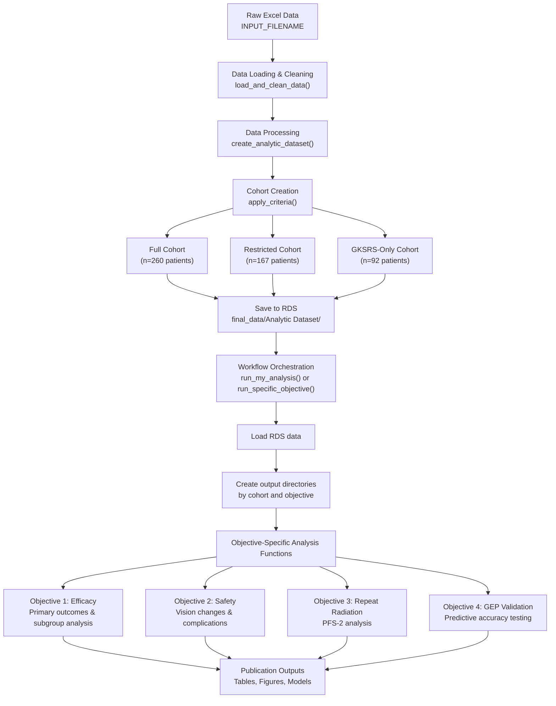

# Uveal Melanoma Treatment Outcomes: GKSRS vs PBT Analysis

## Overview

Analysis pipeline for comparing clinical outcomes in uveal melanoma patients treated with Gamma Knife Stereotactic Radiosurgery (GKSRS) or Proton Beam Therapy (PBT) brachytherapy. Generates tables, figures, and statistical analyses for efficacy, safety, and biomarker validation endpoints across three patient cohorts.

## Citation

Marquis TJ*, Camarda ND*, Archambault SD, Mignano JE, Melhus CS, Rodday AM, Duker JS, Desai SJ. *A Retrospective Analysis of Plaque Brachytherapy vs. Gamma-Knife Stereotactic Radiosurgery in the First-Line Localized Treatment of Uveal Melanoma.* In preparation.

---

## Quick Start

### Prerequisites

- **R >= 4.4.0**
- Raw Excel data file
- ~5 minutes for full analysis

### Installation

```r
# 1. Clone repository and navigate to project root
# 2. Dependencies install automatically when running:
source("scripts/load_all.R")
```

### Basic Usage

```r
# Run complete analysis (all cohorts, all objectives)
main_execution()

# Run specific cohort
run_my_analysis("uveal_melanoma_full_cohort")

# Run specific objective
run_specific_objective("uveal_melanoma_full_cohort", 1)  # Efficacy only
```

### Output

- Excel tables (.xlsx)
- Figures (.png, 300 DPI)
- Analysis logs
- Organized by cohort/objective/analysis

---

## Study Design

### Patient Cohorts


| Cohort         | N   | Definition                   | Purpose                                      |
| ---------------- | ----- | ------------------------------ | ---------------------------------------------- |
| **Full**       | 260 | All GKSRS or PBT patients    | Real-world effectiveness                     |
| **Restricted** | 167 | Eligible for both treatments | Balanced comparison (minimal selection bias) |
| **GKSRS-Only** | 92  | Ineligible for PBT           | GKSRS effectiveness in challenging cases     |

**Eligibility criteria for restricted cohort:** Tumor diameter ≤20mm, height ≤10mm, no optic nerve involvement

**Current cohort counts:** Automatically updated counts are tracked in `final_data/Analytic Dataset/cohort_summary_statistics.json`, regenerated with each analysis run.

**Vital status classification:** Patients are categorized as dead (event occurred), alive (recent follow-up within 15 months), or lost to follow-up (no contact >15 months from data cutoff). See [detailed methodology →](docs/CALCULATIONS.md#lost-to-follow-up-classification)

📖 **[Full cohort definitions and rationale →](docs/TECHNICAL.md#cohort-definitions)**

---

## Research Objectives


| Objective               | Status         | Key Analyses                                                             | Outputs                               |
| ------------------------- | ---------------- | -------------------------------------------------------------------------- | --------------------------------------- |
| **1. Efficacy**         | ✅ Complete    | Local recurrence, metastasis, survival (OS/PFS), tumor height, subgroups | Tables, survival curves, forest plots |
| **2. Safety**           | ✅ Complete    | Vision changes, retinopathy, glaucoma, retinal detachment                | Tables, regression models             |
| **3. Repeat Radiation** | ✅ Complete    | PFS-2 analysis for salvage treatment                                     | Survival curves, Cox models           |
| **4. GEP Validation**   | 🚧 In Progress | Calibration, discrimination, clinical utility, PRAME augmentation        | Cohort-specific workbooks, text summaries, KM/CIF plots |

📖 **[Detailed objectives and sub-analyses →](docs/TECHNICAL.md#research-objectives)**

---

## Vision Change Outputs

Objective 2 tracks logMAR deltas (positive = improved vision) alongside Snellen-line changes for every cohort. For full derivations, signs, and bucket definitions, see [docs/CALCULATIONS.md → Vision Change](docs/CALCULATIONS.md#vision-change).

- `*_vision_changes.html` now bundles the logMAR summary, Snellen-line summary, and the bucketed line-change table (≥3/±1-line categories) in one review-ready file.
- `*_vision_line_change_summary.html` stacks the Snellen line-change summary, the bucketed table, and the full line-by-line distribution for downstream review and merged-table ingestion.
- Excel exports (`*_vision_line_change_distribution.xlsx`, `*_vision_line_change_bucket_summary.xlsx`) mirror the HTML tables for downstream audit trails.

---

## Usage

### Configuration

Edit `scripts/utils/config_constants.R`:

```r
INPUT_FILENAME <- "your_data_file.xlsx"
RECREATE_ANALYTIC_DATASETS <- TRUE
USE_LOGS <- TRUE
```

### Execution Options

```r
# Option 1: Full analysis (recommended for first run)
main_execution()

# Option 2: Single cohort, all objectives
run_my_analysis("uveal_melanoma_full_cohort")
run_my_analysis("uveal_melanoma_restricted_cohort")
run_my_analysis("uveal_melanoma_gksrs_only_cohort")

# Option 3: Specific cohort + objective
run_specific_objective("uveal_melanoma_full_cohort", 1)  # Efficacy
run_specific_objective("uveal_melanoma_full_cohort", 2)  # Safety
run_specific_objective("uveal_melanoma_full_cohort", 3)  # Repeat radiation
run_specific_objective("uveal_melanoma_full_cohort", 4)  # GEP validation
```

### Workflow Execution

The pipeline runs through structured objectives:

1. **Objective 0:** Data processing and cohort creation
2. **Objective 1:** Efficacy analysis (recurrence, survival, tumor height, subgroups)
3. **Objective 2:** Safety analysis (vision, complications)
4. **Objective 3:** PFS-2 analysis for salvage treatment
5. **Objective 4:** GEP biomarker validation (in progress)

### Cohort-first output layout

All analysis outputs are written inside each cohort folder under `final_data/Analysis/`.

- General cohort summaries live in `00_General/` inside each cohort, for example:
    - `final_data/Analysis/uveal_full/00_General/baseline_characteristics/`
    - `final_data/Analysis/uveal_restricted/00_General/treatment_duration/`
    - `final_data/Analysis/gksrs/00_General/baseline_characteristics/`
- Objective 4 outputs live in `04_GEP_Validation/` inside each cohort.

For Objective 4, the current artifact hierarchy is:

1. outcome-specific consolidated workbooks: `*_MFS_consolidated_summary.xlsx`, `*_MSS_consolidated_summary.xlsx`
2. outcome-specific technical workbooks and narrative summaries: `*mfs_validation_summary.xlsx`, `*mss_validation_summary.xlsx`, `*mfs_validation_summary.txt`, `*mss_validation_summary.txt`
3. cross-outcome workbook at the root of `04_GEP_Validation/`: `*unified_gep_validation_summary.xlsx`
4. simple QC workbook in `04_GEP_Validation/unified_summary/`: `*simple_gep_validation.xlsx`

The consolidated outcome workbooks are the primary review-facing artifacts. They now include an `Observed_Expected_Summary` sheet, while `PRAME_Summary` is always written even when the cohort only supports an explanatory placeholder row. The technical `*_validation_summary.xlsx` workbooks are now detail-only companions and no longer duplicate high-level calibration/discrimination summary tables.

📖 **[Detailed workflow documentation →](docs/TECHNICAL.md#workflow-orchestration-system)**

---

## Output Organization

```
final_data/
├── Analytic Dataset/           # Processed cohort data
│   ├── cohort_summary_statistics.json  # ← Auto-updated cohort counts & outcomes
│   ├── uveal_melanoma_full_cohort.rds
│   ├── uveal_melanoma_restricted_cohort.rds
│   └── uveal_melanoma_gksrs_only_cohort.rds
├── Analysis/
│   ├── uveal_full/              # Full cohort (n=260)
│   │   ├── 00_General/          # Baseline characteristics
│   │   ├── 01_Efficacy/         # Primary outcomes
│   │   │   ├── a_recurrence/
│   │   │   ├── c_overall_survival/
│   │   │   ├── d_progression_free_survival/
│   │   │   ├── e_tumor_height_primary/
│   │   │   └── g_subgroup_analysis/forest_plots/
│   │   ├── 02_Safety/           # Vision & complications
│   │   ├── 03_Repeat_Radiation/ # PFS-2 analysis
│   │   └── 04_GEP_Validation/   # 🚧 Under construction
│   ├── uveal_restricted/        # Restricted cohort (n=167)
│   └── gksrs/                   # GKSRS-only cohort (n=92)
```

📖 **[Complete directory structure →](docs/TECHNICAL.md#directory-structure)**

---

## Requirements

### R Environment

- **R >= 4.4.0**

### Core Packages

```r
tidyverse, readxl, writexl, survival, survminer, survRM2
gtsummary, gt, forestploter, ggplot2
```

### Advanced Packages (for GEP validation)

```r
rms, pec, riskRegression, cmprsk, pROC, rmda
```

📦 **Automatic installation via `scripts/load_all.R`**

---

## Documentation

### 📖 Comprehensive Guides


| Document                                                    | Description                                                                                                                             |
| ------------------------------------------------------------- | ----------------------------------------------------------------------------------------------------------------------------------------- |
| **[TECHNICAL.md](docs/TECHNICAL.md)**                       | Implementation details, workflow system, cohort definitions, quality assurance                                                          |
| **[CALCULATIONS.md](docs/CALCULATIONS.md)**                 | **How derived variables are calculated** (tumor height change, vision change, time-to-event variables, handling of recurrence patients) |
| **[STATISTICAL_METHODS.md](docs/STATISTICAL_METHODS.md)**   | RMST analysis, proportional hazards testing, competing risks, GEP validation methodology                                                |
| **[INTERPRETATION_GUIDE.md](docs/INTERPRETATION_GUIDE.md)** | How to read outputs, clinical interpretation, forest plots, survival curves                                                             |

### 🎯 Quick Links by Topic

**Understanding Calculations:**

- [Why tumor height change can be negative](docs/CALCULATIONS.md#tumor-height-change)
- [Vision change and logMAR scale](docs/CALCULATIONS.md#vision-change)
- [Why recurrence patients use different measurements](docs/CALCULATIONS.md#why-different-measurements-for-recurrence-patients)
- [Time-to-event variable construction](docs/CALCULATIONS.md#time-to-event-variables)

**Statistical Methods:**

- [What is RMST and why we use it](docs/STATISTICAL_METHODS.md#restricted-mean-survival-time-rmst)
- [Proportional hazards assumption testing](docs/STATISTICAL_METHODS.md#proportional-hazards-assumption-testing)
- [Competing risks analysis for MSS](docs/STATISTICAL_METHODS.md#competing-risks-analysis)
- [GEP validation metrics explained](docs/STATISTICAL_METHODS.md#gep-validation-metrics)

**Interpreting Outputs:**

- [GEP workbook logistics + sheet dictionary](docs/INTERPRETATION_GUIDE.md#understanding-gep-analysis)

**Technical Implementation:**

- [Complete workflow system](docs/TECHNICAL.md#workflow-orchestration-system)
- [Data quality checkpoints](docs/TECHNICAL.md#quality-assurance)
- [Error handling and limitations](docs/TECHNICAL.md#data-limitations)
- [Subgroup analysis filtering](docs/TECHNICAL.md#subgroup-filtering)

---

## Data Processing Pipeline

The analysis follows this workflow:

1. **Load & Clean** - Excel data → validated data frame
2. **Process & Derive** - Calculate derived variables (see [CALCULATIONS.md](docs/CALCULATIONS.md))
3. **Create Cohorts** - Apply eligibility criteria
4. **Save RDS** - Store processed datasets
5. **Run Analyses** - Execute objectives
6. **Generate Outputs** - Create tables and figures

Quality checks, logging, and error handling at each step.

### Pipeline Diagram


```mermaid
flowchart TD
    A["Raw Excel Data<br/>INPUT_FILENAME"] --> B["Data Loading & Cleaning<br/>load_and_clean_data()"]
    B --> C["Data Processing<br/>create_analytic_dataset()"]
    C --> D["Cohort Creation<br/>apply_criteria()"]
  
    D --> I["Full Cohort<br/>(n=260 patients)"]
    D --> J["Restricted Cohort<br/>(n=167 patients)"]
    D --> K["GKSRS-Only Cohort<br/>(n=92 patients)"]
  
    I --> L["Save to RDS<br/>final_data/Analytic Dataset/"]
    J --> L
    K --> L
  
    L --> M["Workflow Orchestration<br/>run_my_analysis() or run_specific_objective()"]
    M --> N["Load RDS data"]
    N --> O["Create output directories<br/>by cohort and objective"]
    O --> P["Objective-Specific Analysis Functions"]
  
    P --> Q["Objective 1: Efficacy<br/>Primary outcomes & subgroup analysis"]
    P --> R["Objective 2: Safety<br/>Vision changes & complications"]
    P --> S["Objective 3: Repeat Radiation<br/>PFS-2 analysis"]
    P --> T["Objective 4: GEP Validation<br/>Predictive accuracy testing"]
  
    Q --> U["Publication Outputs<br/>Tables, Figures, Models"]
    R --> U
    S --> U
    T --> U
```

📖 **[Full pipeline details and quality assurance →](docs/TECHNICAL.md#data-processing-workflow)**

---

---

## License

*Research use only - no license currently specified.*

---

**For detailed implementation status, statistical methods, and technical documentation, see the [Documentation](#documentation) section above.**
