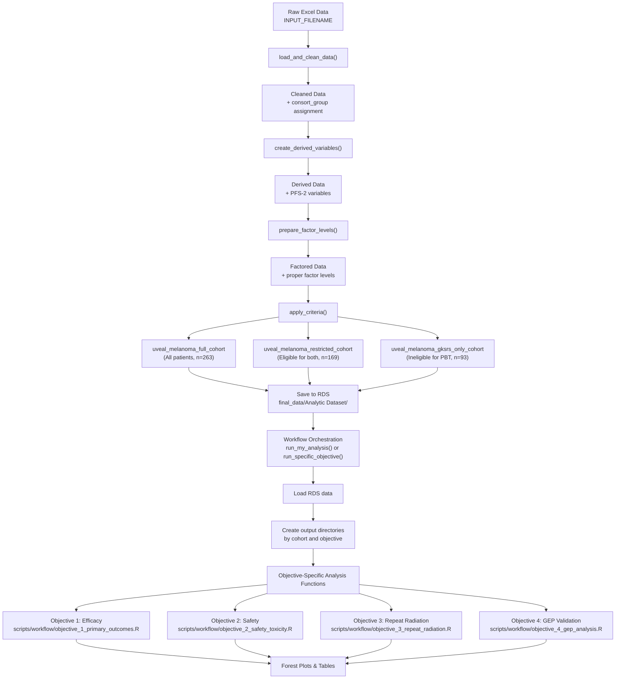

# Uveal Melanoma: GKSRS vs PBT

## Overview

This project provides a complete pipeline for processing, cleaning, and analyzing clinical data for uveal melanoma patients, with a focus on comparing outcomes between Gamma Knife Stereotactic Radiosurgery (GKSRS) and PBT brachytherapy. The analysis is organized around **4 primary study objectives** with results structured for easy navigation by research question.

**Author:** Nicholas Camarda

---

## Quick Start

1. Clone the repository and install the required R packages (see `scripts/load_all.R` for package list).
2. Review `scripts/load_all.R` to set important constants at runtime.
3. (Optional) Review `scripts/utils/config_constants.R` for more detailed constants used throughout the analysis.
4. Open an R session in the project root and run:

```r
# Load all helper functions
source("scripts/load_all.R")    

# Run analysis for all cohorts and all objectives
main_execution()

# Or run specific objectives for targeted analysis
run_specific_objective("uveal_melanoma_full_cohort", 1)  # Primary outcomes only
run_specific_objective("uveal_melanoma_full_cohort", 2)  # Safety/toxicity only
run_specific_objective("uveal_melanoma_full_cohort", 3)  # Repeat radiation only
run_specific_objective("uveal_melanoma_full_cohort", 4)  # GEP validation only

# Or run a single cohort analysis
run_my_analysis("uveal_melanoma_full_cohort")
```

3. Outputs (Excel, HTML, PNG, RDS) and full log files are written to the `final_data/Analysis/` and `logs/` folders, organized exactly as described below.

---

## Study Objectives

The analysis is structured around four prioritized research objectives:

### **Objective 1: Efficacy of PBT vs GKSRS (COMPLETE)**
**Primary research question:** How do clinical outcomes compare between treatments?
- **1a.** Local recurrence rates
- **1b.** Metastatic progression rates  
- **1c.** Overall survival
- **1d.** Progression-free survival
- **1e.** Tumor height changes (primary analysis)
- **1f.** Tumor height changes (sensitivity analysis) 
- **1g.** Subgroup analysis (treatment effect heterogeneity)

### **Objective 2: Safety/Toxicity (COMPLETE)**
**Primary research question:** What are the comparative safety profiles?
- **2a.** Vision changes
- **2b.** Radiation retinopathy rates
- **2c.** Neovascular glaucoma rates
- **2d.** Serous retinal detachment rates

### **Objective 3: Repeat Radiation Efficacy (COMPLETE)**  
**Primary research question:** How effective are second-line treatments?
- **3a.** Progression-Free Survival-2 (PFS-2) analysis

### **Objective 4: GEP Predictive Accuracy (COMPLETE)**
**Primary research question:** How well do gene expression profiles predict outcomes?
- **4a.** Metastasis-free survival validation
- **4b.** Melanoma-specific survival validation

---

## Data Processing Workflow

The analysis follows a systematic data processing pipeline with built-in validation checkpoints:


```mermaid
flowchart TD
    A["Raw Excel Data<br/>INPUT_FILENAME"] --> B["load_and_clean_data()"]
    B --> C["Cleaned Data<br/>+ consort_group assignment"]
    C --> D["create_derived_variables()"]
    D --> E["Derived Data<br/>+ PFS-2 variables"]
    E --> F["prepare_factor_levels()"]
    F --> G["Factored Data<br/>+ proper factor levels"]
    G --> H["apply_criteria()"]
    
    H --> I["uveal_melanoma_full_cohort<br/>(All patients, n=263)"]
    H --> J["uveal_melanoma_restricted_cohort<br/>(Eligible for both, n=169)"]
    H --> K["uveal_melanoma_gksrs_only_cohort<br/>(Ineligible for PBT, n=93)"]
    
    I --> L["Save to RDS<br/>final_data/Analytic Dataset/"]
    J --> L
    K --> L
    
    L --> M["Workflow Orchestration<br/>run_my_analysis() or run_specific_objective()"]
    M --> N["Load RDS data"]
    N --> O["Create output directories<br/>by cohort and objective"]
    O --> P["Objective-Specific Analysis Functions"]
    
    P --> Q["Objective 1: Efficacy<br/>scripts/workflow/objective_1_primary_outcomes.R"]
    P --> R["Objective 2: Safety<br/>scripts/workflow/objective_2_safety_toxicity.R"]
    P --> S["Objective 3: Repeat Radiation<br/>scripts/workflow/objective_3_repeat_radiation.R"]
    P --> T["Objective 4: GEP Validation<br/>scripts/workflow/objective_4_gep_analysis.R"]
    
    Q --> U["Forest Plots & Tables"]
    R --> U
    S --> U
    T --> U
```

## Workflow Orchestration System

The analysis now uses a modular workflow system that allows for targeted execution:

### **Main Functions**
- **`main_execution()`**: Runs complete analysis for all cohorts and objectives
- **`run_my_analysis(dataset_name)`**: Runs all objectives for a specific cohort
- **`run_specific_objective(dataset_name, objective_number)`**: Runs a single objective for a specific cohort

### **Objective-Specific Scripts**
Each objective has its own dedicated workflow script:
- **`objective_0_data_processing.R`**: Data cleaning and validation
- **`objective_1_primary_outcomes.R`**: Efficacy analysis (survival, tumor height, subgroup analysis)
- **`objective_2_safety_toxicity.R`**: Safety and toxicity endpoints
- **`objective_3_repeat_radiation.R`**: PFS-2 analysis
- **`objective_4_gep_analysis.R`**: GEP validation analysis

### **Benefits of New Workflow**
- **Incremental Analysis**: Run specific objectives without re-running entire pipeline
- **Error Isolation**: Issues in one objective don't affect others
- **Development Efficiency**: Test individual objectives during development
- **Resource Management**: Run memory-intensive analyses separately

---

## Cohort Definitions

The analysis includes three distinct patient cohorts based on tumor characteristics and treatment eligibility:

### **Full Cohort** (n=263)
- **Definition:** All patients who received either GKSRS or PBT brachytherapy
- **Purpose:** Real-world effectiveness comparison across all tumor sizes and locations

### **Restricted Cohort** (n=169) 
- **Definition:** Patients eligible for **both** treatments
- **Criteria:** Tumor diameter ≤20mm AND height ≤10mm AND no optic nerve involvement
- **Purpose:** Balanced comparison minimizing treatment selection bias

### **GKSRS-Only Cohort** (n=93)
- **Definition:** Patients **ineligible** for PBT brachytherapy
- **Criteria:** Tumor diameter >20mm OR height >10mm OR optic nerve involvement
- **Purpose:** GKSRS effectiveness in challenging cases where PBT is not feasible

---

## Directory Structure

Analysis outputs are organized by **cohort → objective → sub-objective**:

```
project_working_directory/
├── data/
├── final_data/
│   ├── Analytic Dataset/
│   └── Analysis/
│       ├── uveal_full/
│       │   ├── 00_General/
│       │   ├── 01_Efficacy/
│       │   │   ├── a_recurrence/
│       │   │   ├── b_metastatic_progression/
│       │   │   ├── c_overall_survival/
│       │   │   ├── d_progression_free_survival/
│       │   │   ├── e_tumor_height_primary/
│       │   │   ├── f_tumor_height_sensitivity/
│       │   │   ├── g_subgroup_analysis/
│       │   │   │   ├── tumor_height_primary/
│       │   │   │   ├── tumor_height_sensitivity/
│       │   │   │   └── forest_plots/
│       │   │   └── h_proportional_hazards_diagnostics/
│       │   ├── 02_Safety/
│       │   │   ├── a_vision_changes/
│       │   │   ├── b_retinopathy/
│       │   │   ├── c_neovascular_glaucoma/
│       │   │   └── d_serous_retinal_detachment/
│       │   ├── 03_Repeat_Radiation/
│       │   │   ├── a_pfs2/
│       │   │   └── b_proportional_hazards_diagnostics/
│       │   └── 04_GEP_Validation/
│       │       ├── a_metastasis_free_survival/
│       │       └── b_melanoma_specific_survival/
│       ├── uveal_restricted/
│       └── gksrs/
├── logs/
├── scripts/
│   ├── main.R                              # Main analysis entrypoints
│   ├── data_helper/
│   │   ├── cohort_creation.R               # Cohort application/saving
│   │   ├── cohort_orchestration.R          # Data processing orchestration
│   │   ├── data_derivation.R               # Derived variable creation
│   │   ├── data_loading.R                  # Raw data loading/cleaning
│   │   ├── data_summaries.R                # QC summaries
│   │   └── data_utilities.R                # Shared helpers
│   ├── analysis/
│   │   ├── binary_outcomes.R               # Logistic endpoints
│   │   ├── rmst_visualization.R            # RMST utilities/plots
│   │   ├── survival_outcomes.R             # KM/Cox + PH testing helpers
│   │   ├── tumor_height_analysis.R         # Linear model analyses
│   │   └── vision_safety_analysis.R        # Safety endpoints
│   ├── subgroup/
│   │   ├── subgroup_binary.R               # Binary subgroup models
│   │   ├── subgroup_data_prep.R            # Subgroup data prep
│   │   ├── subgroup_formatting.R           # HTML/Excel formatting
│   │   ├── subgroup_height.R               # Height subgroup models
│   │   └── subgroup_survival.R             # Survival subgroup models
│   ├── tables/
│   │   ├── table_diagnostics.R             # Capture diagnostics
│   │   ├── table_diagnostics_extras.R      # Supplemental diagnostics
│   │   ├── table_formatting.R              # Captions/headers/labels
│   │   ├── table_generation_core.R         # Core table generation
│   │   ├── table_io.R                      # Writers/readers
│   │   └── table_model_fitting.R           # Model fitting
│   ├── visualization/
│   │   ├── forest_plot_data.R              # Data assembly
│   │   ├── forest_plot_draw.R              # Plot drawing
│   │   └── forest_plot_formatting.R        # Theming/formatting
│   ├── utils/
│   ├── load_all.R                          # Central loader/sourcing
│   │   ├── config_constants.R              # Global configuration
│   │   ├── extreme_estimate_handling.R     # Extreme estimate filtering
│   │   ├── forest_plot_diagnostics.R       # Forest diagnostics
│   │   ├── logging_utilities.R             # Logging
│   │   ├── model_utilities.R               # Model helpers
│   │   ├── output_utilities.R              # Output helpers (HTML save hardened)
│   │   └── validation_utilities.R          # Data validation
│   ├── workflow/
│   │   ├── analysis_orchestration.R        # Main orchestration
│   │   ├── objective_0_data_processing.R   # Objective 0
│   │   ├── objective_1_primary_outcomes.R  # Objective 1
│   │   ├── objective_2_safety_toxicity.R   # Objective 2
│   │   ├── objective_3_repeat_radiation.R  # Objective 3
│   │   └── objective_4_gep_analysis.R      # Objective 4
│   └── tests/                              # Unit tests and validation
└── README.md
```

---

## Implementation Status: Analysis Pipeline

### **OBJECTIVE 1: Efficacy Analysis (COMPLETE)**

All primary efficacy analyses have been implemented with comprehensive outputs through the new workflow system:

#### **1a. Local Recurrence**
- **Method:** Binary outcome analysis with logistic regression
- **Implementation:** `analyze_binary_outcome_rates()` function in `scripts/workflow/objective_1_primary_outcomes.R`
- **Outputs:** Event rates (.xlsx), logistic regression models (.html)
- **Location:** `{cohort}/01_Efficacy/a_recurrence/`

#### **1b. Metastatic Progression** 
- **Method:** Binary outcome analysis with logistic regression
- **Implementation:** `analyze_binary_outcome_rates()` function in `scripts/workflow/objective_1_primary_outcomes.R`
- **Outputs:** Event rates (.xlsx), logistic regression models (.html)
- **Location:** `{cohort}/01_Efficacy/b_metastatic_progression/`

#### **1c. Overall Survival**
- **Method:** Kaplan-Meier + Cox regression + RMST analysis
- **Implementation:** `analyze_time_to_event_outcomes()` function in `scripts/workflow/objective_1_primary_outcomes.R`
- **Outputs:** Survival tables (.xlsx), Cox models (.html), survival curves (.png), RMST progression plots (.png)
- **Location:** `{cohort}/01_Efficacy/c_overall_survival/`

#### **1d. Progression-Free Survival**
- **Method:** Composite endpoint (progression OR death) with full survival analysis
- **Implementation:** `analyze_time_to_event_outcomes()` function in `scripts/workflow/objective_1_primary_outcomes.R`
- **Outputs:** Survival tables (.xlsx), Cox models (.html), survival curves (.png), RMST progression plots (.png)
- **Location:** `{cohort}/01_Efficacy/d_progression_free_survival/`

#### **1e. Tumor Height Changes (Primary)**
- **Method:** Linear regression without baseline height adjustment (avoids overadjustment bias)
- **Implementation:** `analyze_tumor_height_changes()` function in `scripts/workflow/objective_1_primary_outcomes.R`
- **Outputs:** Change summaries (.html), regression models (.html)
- **Location:** `{cohort}/01_Efficacy/e_tumor_height_primary/`

#### **1f. Tumor Height Changes (Sensitivity)**
- **Method:** Linear regression with baseline height adjustment (robustness check)
- **Implementation:** `analyze_tumor_height_changes()` function in `scripts/workflow/objective_1_primary_outcomes.R`
- **Outputs:** Change summaries (.html), regression models (.html)
- **Location:** `{cohort}/01_Efficacy/f_tumor_height_sensitivity/`

#### **1g. Subgroup Analysis (COMPLETE)**
- **Method:** Interaction testing across patient subgroups for treatment effect heterogeneity
- **Implementation:** Unified `subgroup_analysis.R` with dedicated functions:
  - `analyze_treatment_effect_subgroups_survival()` - For survival outcomes
  - `analyze_treatment_effect_subgroups_binary()` - For binary outcomes  
  - `analyze_treatment_effect_subgroups_height()` - For tumor height changes
- **Subgroups:** Age, sex, tumor location, initial tumor height/diameter
- **Forest Plots:** Comprehensive forest plot visualization with `create_single_cohort_forest_plot()`
- **Outputs:** 
  - **Primary tumor height subgroups:** `{cohort}/01_Efficacy/g_subgroup_analysis/tumor_height_primary/`
  - **Sensitivity tumor height subgroups:** `{cohort}/01_Efficacy/g_subgroup_analysis/tumor_height_sensitivity/`
  - **Forest plots:** `{cohort}/01_Efficacy/g_subgroup_analysis/forest_plots/`

##### **Statistical Filtering and Stability**
The subgroup analysis implements rigorous filtering criteria to ensure statistical validity:

**Filtering Requirements:**
- **Minimum sample size:** ≥2 patients in each treatment group
- **Minimum events:** ≥1 event in each treatment group (for survival outcomes)
- **Statistical stability:** Groups with insufficient events are excluded from analysis

**Risk Comparison Stability:**
- **Zero events in one group → Stable comparison** (risk vs no risk)
  - The Cox model can handle "no risk vs some risk" comparisons mathematically
  - Example: ≥80 years group with 0 PBT events vs 2 GKSRS events produces stable HR
- **Very few events vs many events → Unstable comparison** (unreliable relative risk estimation)
  - Extreme imbalances create statistical instability and infinite confidence intervals
  - Example: 50-59 years group with 1 PBT event vs 8 GKSRS events produces infinite HR
  - These groups are automatically marked as "skipped_non_finite" in forest plot diagnostics

**Why This Matters:**
The filtering ensures publication-quality results by preventing:
1. Models running on statistically unstable subgroups
2. Infinite hazard ratios and confidence intervals  
3. Inconsistent filtering between different outcome types
4. Meaningless statistical comparisons that could mislead interpretation

### **OBJECTIVE 2: Safety/Toxicity Analysis (COMPLETE)**

All safety endpoint analyses have been implemented through the new workflow system:

#### **2a. Vision Changes**
- **Method:** Linear regression analysis of visual acuity changes
- **Implementation:** `analyze_visual_acuity_changes()` function in `scripts/workflow/objective_2_safety_toxicity.R`
- **Outputs:** Vision change summaries (.html), regression models (.html)  
- **Location:** `{cohort}/02_Safety/a_vision_changes/`

#### **2b. Radiation Retinopathy**
- **Method:** Binary outcome analysis with logistic regression
- **Implementation:** `analyze_radiation_complications()` function in `scripts/workflow/objective_2_safety_toxicity.R`
- **Outputs:** Complication rates (.xlsx), logistic regression models (.html)
- **Location:** `{cohort}/02_Safety/b_retinopathy/`

#### **2c. Neovascular Glaucoma**
- **Method:** Binary outcome analysis with logistic regression  
- **Implementation:** `analyze_radiation_complications()` function in `scripts/workflow/objective_2_safety_toxicity.R`
- **Outputs:** Complication rates (.xlsx), logistic regression models (.html)
- **Location:** `{cohort}/02_Safety/c_neovascular_glaucoma/`

#### **2d. Serous Retinal Detachment**
- **Method:** Binary outcome analysis (radiation-induced only) with logistic regression
- **Implementation:** `analyze_radiation_complications()` function in `scripts/workflow/objective_2_safety_toxicity.R`
- **Outputs:** Complication rates (.xlsx), logistic regression models (.html)
- **Location:** `{cohort}/02_Safety/d_serous_retinal_detachment/`

### **OBJECTIVE 3: Repeat Radiation Efficacy (COMPLETE)**

#### **3a. Progression-Free Survival-2 (PFS-2)**
- **Method:** Survival analysis for patients with local recurrence receiving second-line treatment
- **Implementation:** `analyze_pfs2()` function in `scripts/workflow/objective_3_repeat_radiation.R`
- **Outputs:** PFS-2 characteristics tables (.xlsx), survival curves (.png), Cox models (.html)
- **Location:** `{cohort}/03_Repeat_Radiation/a_pfs2/`
- **Note:** Analysis automatically skips survival modeling when insufficient events are present (minimum: 5 total events across 2+ treatment groups)

### **OBJECTIVE 4: GEP Predictive Accuracy (COMPLETE)**

Gene expression profile validation analyses using survival model validation methods:

#### **4a. Metastasis-Free Survival Validation**
- **Status:** Fully implemented (full validation suite)
- **Method:** Multi-timepoint validation (5, 7, 10 years) with Nam-D'Agostino χ² calibration tests, Uno's C-index, cumulative ROC curves, decision curve analysis, and bootstrap validation
- **Implementation:** `analyze_gep_mfs_validation()` function in `scripts/workflow/objective_4_gep_analysis.R`
- **Outputs:** Comprehensive validation reports (.xlsx), calibration plots (.png), discrimination metrics (.xlsx), decision curves (.png)
- **Location:** `{cohort}/04_GEP_Validation/a_metastasis_free_survival/`

#### **4b. Melanoma-Specific Survival Validation**  
- **Status:** Fully implemented with dual competing-risk models
- **Method:** Standard survival analysis plus Fine-Gray competing risk models with cumulative incidence functions. Time-dependent discrimination (Harrell/Uno C-index) and decision curve analysis are performed at 5/7/10 years when event counts meet thresholds; plots are generated only when real data support them (no placeholders).
- **Implementation:** `analyze_gep_mss_validation()` function in `scripts/workflow/objective_4_gep_analysis.R`
- **Outputs:** Standard and competing risk validation reports (.xlsx), cumulative incidence curves (.png), discrimination and DCA summaries/plots when available (.xlsx/.png)
- **Location:** `{cohort}/04_GEP_Validation/b_melanoma_specific_survival/`

#### **Secondary Analyses**
- **PRAME-Augmented Models:** Net reclassification index comparing GEP-only vs GEP+PRAME models
- **Missing Data Assessment:** Multiple imputation sensitivity analysis and baseline comparison of GEP-tested vs missing patients
- **Bootstrap Validation:** Optimism-corrected calibration slopes and intercepts (200 bootstrap iterations)
- **Events-per-Endpoint Analysis:** Automatic assessment of statistical power (target: ≥100 events per timepoint)

---

## Data Limitations and Analysis Constraints

The analysis pipeline includes robust error handling for situations where data limitations prevent certain analyses from completing. This is particularly relevant for smaller cohorts and rare outcomes.

### **Cohort-Specific Limitations**

#### **GKSRS-Only Cohort (n=93)**
- **Step 3 (PFS-2 Analysis):** Insufficient events for survival analysis
  - Only 13 patients with valid PFS-2 data
  - Only 3 total second recurrence events (minimum required: 5)
  - Events concentrated in only 2 treatment groups (GKSRS: 1, TTT: 2)
  - Summary tables are generated, but survival curves and Cox models are skipped

#### **Restricted Cohort (n=169)**
- Generally sufficient sample size for most analyses
- Occasional rare category handling in subgroup analyses due to smaller size than full cohort

#### **Full Cohort (n=263)**
- Generally sufficient sample size for most analyses
- Occasional rare category handling in subgroup analyses

### **Automatic Error Handling**

The analysis pipeline includes built-in safeguards:

1. **Minimum Event Requirements:** 
   - Survival analyses require 5+ total events
   - Cox regression requires 2+ groups with events
   - Logistic regression requires adequate observations per category

2. **Rare Category Management:**
   - Categories with <5 observations are automatically collapsed
   - Variables with insufficient levels after collapsing are excluded from models

3. **Graceful Degradation:**
   - When full analyses cannot be completed, summary statistics are still generated
   - Missing analyses are clearly documented in logs with specific reasons

4. **Comprehensive Logging:**
   - All limitations and skipped analyses are logged with timestamps
   - Detailed error messages explain exactly why analyses were skipped

### **Example Run**

A recent run of the analysis demonstrates this error handling:

**GKSRS-Only Cohort - Step 3 (PFS-2):**
- Found 13 patients with local recurrence receiving second-line treatment
- Treatment distribution: Enucleation (8), GKSRS (1), TTT (2), Other (2)
- Only 3 total second recurrence events detected
- Analysis automatically skipped survival modeling due to insufficient events
- Summary tables still generated for available data

---

## Key Features

### **🌲 Forest Plot Functionality**
Comprehensive forest plot generation for subgroup analysis visualization:

- **Modules:** `scripts/visualization/forest_plot_data.R`, `forest_plot_draw.R`, `forest_plot_formatting.R`
- **Features:**
  - Dynamic effect measure handling (HR, OR, MD)
  - Automatic log scale for HR/OR, linear scale for mean differences
  - Formatting with confidence intervals
  - Treatment direction indicators ("Favours GKSRS" vs "Favours PBT")
- **Generated For:** All subgroup analyses across all primary outcomes
- **Location:** `{cohort}/01_Efficacy/g_subgroup_analysis/forest_plots/`

### **🎯 Consolidated Subgroup Analysis**
Modular subgroup analysis framework:

- **Files:**
  - `scripts/subgroup/subgroup_data_prep.R` — data preparation
  - `scripts/subgroup/subgroup_survival.R` — survival subgroup models
  - `scripts/subgroup/subgroup_binary.R` — binary subgroup models
  - `scripts/subgroup/subgroup_height.R` — height subgroup models
  - `scripts/subgroup/subgroup_formatting.R` — HTML/Excel table formatting
- **Functions:**
  - `analyze_treatment_effect_subgroups_survival()`
  - `analyze_treatment_effect_subgroups_binary()`
  - `analyze_treatment_effect_subgroups_height()`
  - `format_subgroup_analysis_results()` / `format_subgroup_analysis_tables()`
- **Coverage:** All primary outcomes + tumor height changes (primary & sensitivity)
- **Output:** Standardized interaction p-values, subgroup-specific effects, forest plots

### **📊 Analysis Configuration**
Set analysis settings globally to improve reproducibility:

- **File:** `scripts/utils/config_constants.R`
- **Features:** Centralized configuration, consistent variable definitions, confounder specifications, treatment factor levels, plot dimensions, GEP validation settings
- **Benefits:** Easy modification of analysis parameters, consistent methodology across objectives

### **🔄 Centralized Helper Functions**
All libraries and utilities loaded through a single source:

- **File:** `scripts/load_all.R`
- **Features:** Automatic library loading, centralized script sourcing, directory creation, validation functions
- **Benefits:** Consistent environment setup, reduced redundancy, centralized error handling

### **🔄 Workflow Orchestration**
New objective-specific workflow system for targeted analysis:

- **Main Orchestration:** `scripts/workflow/analysis_orchestration.R` with `run_my_analysis()` and `run_specific_objective()` functions
- **Objective Scripts:** Individual workflow scripts for each objective (0-4) in `scripts/workflow/`
- **Benefits:** Run specific objectives independently, better error handling, incremental analysis capability

### **📋 Enhanced Logging System**
Comprehensive logging and monitoring:

- **File:** `scripts/utils/logging_utilities.R`
- **Features:** Timestamped logs, progress tracking, error reporting, log file management
- **Benefits:** Better debugging, progress monitoring, audit trail for analysis runs

---

## Survival Analysis Features

### **Restricted Mean Survival Time (RMST) Analysis**

All survival endpoints include comprehensive RMST analysis. RMST is used because hazard ratios from Cox regression only tell us about relative risk, not the actual magnitude of survival benefit in clinically meaningful time units (months/years). RMST quantifies the average survival time difference between treatments, making results more interpretable for clinicians and patients.

#### **RMST Outputs Generated:**
1. **📈 Survival Rate Tables:** 1, 3, 5, 10, and 15-year survival probabilities by treatment
2. **📊 RMST Comparison Tables:** Mean survival time differences (GKSRS vs PBT) at each time point  
3. **📉 P-value Progression Plots:** Visual representation of statistical significance evolution over time

#### **🎨 RMST P-value Progression Plots**
- **Purpose:** Shows how treatment differences evolve across follow-up periods
- **Features:**
  - P-values plotted across multiple time points (1, 3, 5, 10, 15 years)
  - Color-coded significance levels (red = significant, blue = not significant)
  - Reference lines at p = 0.05 and p = 0.01
  - Annotations with exact p-values and RMST differences in months
  - Treatment direction indicators (+ = GKSRS advantage, - = GKSRS disadvantage)
- **Clinical Value:** Identifies optimal time points for treatment comparisons and quantifies survival benefit magnitude
- **Location:** `{cohort}/01_Efficacy/{outcome}/` for OS and PFS analyses

#### **Example Interpretation:**
- **p = 0.033, +2.1 mo** at 3 years = GKSRS provides 2.1 months longer survival (p = 0.033)
- **p = 0.331, -1.2 mo** at 10 years = No significant difference, slight numerical GKSRS disadvantage

### **Proportional Hazards Assumption Testing**

All Cox regression analyses automatically include comprehensive testing of the proportional hazards (PH) assumption using Schoenfeld residuals to detect time-varying treatment effects.

#### **What is the Proportional Hazards Assumption?**
The Cox proportional hazards model assumes that the hazard ratio between treatment groups remains **constant over time**. When this assumption is violated, it means the treatment effect changes over time - for example, "PBT significant survival early on then GKSRS seems to take over."

#### **Files Generated**
For each survival outcome, the analysis creates these files in the `h_proportional_hazards_diagnostics/` directory:

**1. Test Results (`*_proportional_hazards_tests.xlsx`)**
- **P_Value**: Statistical test for each variable
- **PH_Assumption**: "VIOLATED" if p < 0.05, "OK" if p ≥ 0.05
- **Interpretation**: Plain English explanation of the test result

**2. Diagnostic Plots**
- **Individual plots** (`*_schoenfeld_*.png`): One plot per variable showing residuals vs time
- **Combined plot** (`*_schoenfeld_combined.png`): All variables in one figure

**3. Summary Text** (`*_proportional_hazards_summary.txt`)
- Detailed interpretation and recommendations

#### **How to Interpret Results**

**Statistical Tests:**
- **p < 0.05**: **VIOLATION** - The treatment effect changes significantly over time
- **p ≥ 0.05**: **OK** - No evidence that treatment effect changes over time
- **Global test**: Overall test across all variables in the model

**Schoenfeld Residual Plots:**
These plots show if the treatment effect is constant over time:
- **Flat horizontal line around zero**: PH assumption is satisfied
- **Clear trend (slope up or down)**: PH assumption is violated
- **Curved pattern**: Treatment effect changes non-linearly over time

#### **What to Do if PH is Violated**

1. **Time-varying coefficients**: Fit models that allow treatment effects to change over time
2. **Stratification**: Stratify by the violating variable
3. **Piecewise models**: Fit separate models for early vs late time periods
4. **Alternative models**: Consider accelerated failure time models

#### **Clinical Interpretation**

If **treatment_group** violates the PH assumption:
- Early survival advantage may favor one treatment
- Late survival advantage may favor the other treatment
- The overall hazard ratio from Cox regression may be misleading
- Consider reporting separate effects for early vs late periods

**Example Scenario**: Overall Survival analysis shows treatment_group p = 0.02 (VIOLATED)

**Clinical meaning**: 
- The treatment effect is not constant over time
- One treatment may be better in the short term, the other in the long term
- The single hazard ratio from Cox regression doesn't tell the full story
- Need to examine when the treatment effects cross over

**Outputs Location:**
- **Objective 1 (Efficacy)**: `{cohort}/01_Efficacy/h_proportional_hazards_diagnostics/`
- **Objective 3 (PFS-2)**: `{cohort}/03_Repeat_Radiation/b_proportional_hazards_diagnostics/`

### **Competing Risk Analysis (Objective 4: GEP Validation)**

#### Plain-English: What Objective 4 Does and Why It Matters
- It checks whether the lab-reported GEP probabilities actually match what happened in your cohort.
- Two outcomes are assessed: metastasis-free survival (MFS) and melanoma-specific survival (MSS).
- We evaluate predictions at clinically relevant time points (5, 7, 10 years).
- For each time point we measure:
  - Calibration: Are predicted risks numerically close to observed risks? (Nam-D’Agostino-style test, calibration slope, ICI)
  - Discrimination: Do higher predicted risks occur in patients who experience events sooner? (Harrell/Uno C-index, time-dependent AUC)
  - Clinical utility: Would using the predictions to decide who to treat or intensify follow-up help patients overall? (Decision curve analysis)
- We also check whether adding PRAME status meaningfully improves classification (reclassification/NRI where feasible).
- Missing-data diagnostics quantify how GEP availability might bias results.

#### What You Get (by cohort in `final_data/Analysis/<cohort>/04_GEP_Validation/`)
- `a_metastasis_free_survival/`
-  - `full_cohort_mfs_validation_summary.xlsx`: canonical workbook with sheets `Observed_Expected_by_class` (includes an Overall row per timepoint), `Calibration`, `Discrimination` (timepoints labeled 5yr/7yr/10yr)
-  - `full_cohort_mfs_validation_summary.txt`: human-readable list of per-timepoint O/E, calibration, discrimination, and DCA highlights
-  - Optional: `*.rds` objects if `GEP_SAVE_RDS=TRUE` (for reproducibility/downstream analysis)
- `b_melanoma_specific_survival/`
-  - `full_cohort_mss_validation_summary.xlsx`: harmonized stacked sheets `Observed_Expected_by_class`, `Calibration`, `Discrimination`, `Counts`, `CompRisk_CIF` (cumulative incidence), `CompRisk_CSC` (cause-specific Cox), `CompetingRisk_FineGray` (Fine-Gray), and `CompRisk_CIF_with_CI` (Aalen-Johansen with stratified bootstrap 95% CIs by class)
-  - `full_cohort_mss_validation_summary.txt`: human-readable list of analyses performed with per-timepoint highlights
-  - Optional: `*.rds` objects if `GEP_SAVE_RDS=TRUE`
- `unified_summary/`
  - `full_cohort_gep_comprehensive_report.txt`: integrated analysis summary
  - `full_cohort_gep_comparison_table.xlsx`: side-by-side MFS vs MSS metrics
  - `full_cohort_mfs_survival_curves.png`: Kaplan-Meier curves by GEP class with log-rank test
  - `full_cohort_mss_cumulative_incidence_curves.png`: competing risk CIFs by GEP class
  - **MFS Survival Curves**: Kaplan-Meier plots showing metastasis-free survival probability over time, stratified by GEP class (Class 1 vs Class 2; 4-class PRAME used where applicable for O/E and tables). Includes log-rank test p-value to assess statistical differences between classes.
  - **MSS Cumulative Incidence Curves**: Plots showing the cumulative probability of melanoma-specific death over time by GEP class, accounting for competing risks (other causes of death). Visualizes the absolute risk differences between GEP classes.
- Optional: `*.rds` objects if `GEP_SAVE_RDS=TRUE` (for reproducibility/downstream analysis)

#### **Statistical Disambiguation: Why Different Plot Types for MFS vs MSS?**

The choice of plot type is based on the **nature of the events** being analyzed:

**MFS (Metastasis-Free Survival) = Standard Survival Analysis**
- **Event**: Metastasis (first occurrence)
- **Censoring**: Death without metastasis, loss to follow-up, end of study
- **Analysis**: **Kaplan-Meier (KM) curves** are appropriate because:
  - We have a single, well-defined event (metastasis)
  - Other events (like non-metastatic death) are treated as censoring
  - We want to know "What's the probability of staying metastasis-free over time?"

**MSS (Melanoma-Specific Survival) = Competing Risks Analysis**
- **Event**: Melanoma death
- **Competing Event**: Non-melanoma death (e.g., heart attack, car accident)
- **Analysis**: **Cumulative Incidence Functions (CIF)** are appropriate because:
  - We have two types of events that can happen
  - Non-melanoma death "competes" with melanoma death
  - We want to know "What's the probability of dying from melanoma specifically?"

**Why Not the Other Way Around?**

**MFS with CIF**: Doesn't make sense because metastasis is a single event type. There's no "competing metastasis" - you either get it or you don't.

**MSS with KM**: Would be wrong because it would treat non-melanoma deaths as censoring, which would overestimate melanoma-specific survival. If someone dies of a heart attack, that's not "censoring" - it's a competing event that prevents them from dying of melanoma.

**In the Data:**
- **MFS**: 16 metastasis events out of 86 patients → KM curves show metastasis-free survival probability
- **MSS**: 15 melanoma deaths, 0 competing deaths → CIF shows cumulative probability of melanoma death

The analysis types are chosen based on the **nature of the events**, not arbitrarily. This setup is statistically correct and follows survival analysis best practices.

How to read the key metrics:
- **Calibration slope ≈ 1.0**: predictions are neither too extreme nor too conservative.
- **ICI closer to 0**: better average agreement between predicted and observed risks.
- **C-index (Harrell/Uno) > 0.7**: good ability to rank patients by risk.
- For MSS, class-specific cumulative incidence (CIF) and 95% CIs are computed via Aalen-Johansen with stratified bootstrap.
- **Decision curves**: net benefit line above “Treat All” and 0 indicates clinical usefulness over a threshold range.

For melanoma-specific survival validation, the analysis employs **dual competing risk approaches** to provide comprehensive assessment of GEP predictive accuracy when patients can die from melanoma or other causes.

#### **Why Two Different Competing Risk Models?**

Both cause-specific Cox regression and Fine-Gray subdistribution hazards are appropriate but answer **different clinical questions**:

**Cause-Specific Cox Regression (`riskRegression::CSC`)**
- **Question:** "What factors affect the **rate** of melanoma death among patients who haven't died yet?"
- **Interpretation:** How does GEP risk affect the hazard of dying from melanoma at any given time
- **Clinical Use:** Understanding biological mechanisms, treatment effects on disease progression
- **Result:** Cause-specific hazard ratio (HR)

**Fine-Gray Subdistribution Hazards (`riskRegression::FGR`)**
- **Question:** "What factors affect the **cumulative probability** of eventually dying from melanoma?"
- **Interpretation:** How does GEP risk affect the absolute risk of melanoma death over time
- **Clinical Use:** Patient counseling about long-term prognosis, clinical prediction models
- **Result:** Subdistribution hazard ratio (SHR)

#### **Practical Example**

Consider a high-risk GEP patient:

- **Cause-specific HR = 3.0**: "Among patients still alive, high-risk GEP patients have 3x the rate of melanoma death"
- **Subdistribution SHR = 2.5**: "High-risk GEP patients have 2.5x higher cumulative probability of melanoma death"

The cause-specific HR is typically larger because it conditions on survival, while the subdistribution SHR accounts for competing mortality reducing overall melanoma death risk.

#### **Implementation Details**

**Data Preparation:**
- **Status coding:** 0 = censored (alive or lost to follow-up), 1 = melanoma death, 2 = competing death (other causes)
- **Time variable:** Years from treatment to death or last follow-up
- **Validation approach:** Both models tested against GEP predictions using Brier scores and IPA metrics

**Validation Metrics:**
- **Brier Score:** Lower = better prediction accuracy
- **IPA (Index of Prediction Accuracy):** Higher = better improvement over null model
- **Comparison:** Results compared against standard Kaplan-Meier (treating competing risks as censored)

**Clinical Interpretation:**
- **Concordant results:** Both approaches yield similar conclusions about GEP validity
- **Discordant results:** May indicate that GEP affects instantaneous risk differently than cumulative risk
- **Complementary value:** Both perspectives enhance understanding of GEP clinical utility

**Outputs Location:**
- **Competing Risk Analysis**: `{cohort}/04_GEP_Validation/b_melanoma_specific_survival/`

---

## Requirements

### **R Version**
- **R >= 4.4.0**

### **Required R Packages**
```r
# Core data manipulation and analysis
tidyverse, readxl, writexl, lubridate, janitor, openxlsx

# Statistical analysis and tables  
gtsummary, survival, survminer, survRM2, gt, broom.helpers, parameters, cardx

# Visualization and plots
forestploter, grid, cowplot, ggplot2

# Advanced GEP validation (Objective 4)
rms, pec, survcomp, riskRegression, cmprsk, pROC, rmda, VIM, mice

# Testing and documentation
testthat, usethis
```

### **Installation**
Running `scripts/load_all.R` in an R session should install the required packages automatically, but if you want to install them yourself first, run: 
```r
install.packages(c(
  "tidyverse", "readxl", "writexl", "lubridate", "gtsummary", "janitor", "openxlsx",
  "gt", "survival", "survminer", "survRM2", "forestploter", "grid", "cowplot", 
  "broom.helpers", "parameters", "cardx", "testthat", "usethis"
))

# Install Bioconductor packages for GEP validation
if (!requireNamespace("BiocManager", quietly = TRUE)) {
  install.packages("BiocManager")
}
BiocManager::install(c("survcomp", "VIM"))
```

---

## Usage

### **1. 📁 Prepare Data**
Place your raw Excel data file in the `final_data/Original Files/` directory.

### **2. ⚙️ Configure Analysis**
Edit `scripts/utils/config_constants.R` to set:
```r
# Input filename
INPUT_FILENAME <- "Ocular Melanoma Master Spreadsheet REVISED FOR STATS (5-10-25, TJM).xlsx"

# Analysis settings
RECREATE_ANALYTIC_DATASETS <- TRUE  # Set to TRUE for fresh analysis
USE_LOGS <- TRUE                    # Enable detailed logging
VERBOSE <- TRUE                     # Show detailed progress
```

### **3. 🚀 Run Analysis**

#### **Option A: Full Analysis (All Objectives, All Cohorts)**
```r
# Run the complete pipeline for all cohorts
# Uncomment the main_execution() line in scripts/main.R, then run:
source("scripts/main.R")
```

#### **Option B: Single Cohort Analysis**
```r
# Run all objectives for a specific cohort
run_my_analysis("uveal_melanoma_full_cohort")
run_my_analysis("uveal_melanoma_restricted_cohort")
run_my_analysis("uveal_melanoma_gksrs_only_cohort")
```

#### **Option C: Specific Objective Analysis**
```r
# Run individual objectives for targeted analysis
run_specific_objective("uveal_melanoma_full_cohort", 0)  # Data processing only
run_specific_objective("uveal_melanoma_full_cohort", 1)  # Primary outcomes only
run_specific_objective("uveal_melanoma_full_cohort", 2)  # Safety/toxicity only
run_specific_objective("uveal_melanoma_full_cohort", 3)  # Repeat radiation only
run_specific_objective("uveal_melanoma_full_cohort", 4)  # GEP validation only
```

### **4. 📊 Analysis Execution**
The pipeline executes:
- **Objective 0:** Data cleaning and validation
- **Objective 1:** Primary outcomes (efficacy analysis)
- **Objective 2:** Safety and toxicity endpoints
- **Objective 3:** Repeat radiation efficacy (PFS-2)
- **Objective 4:** GEP predictive accuracy validation

### **5. 🧪 Validation (Optional)**
```r
# Run unit tests to validate pipeline
library(testthat)
source("scripts/tests/run_all_tests.R")
```

### **6. 📋 Logging and Monitoring**
- **Log Files:** Detailed logs saved to `logs/` directory with timestamps
- **Progress Tracking:** Real-time progress updates during analysis
- **Error Handling:** Comprehensive error reporting and recovery

### **7. 🔧 Current Configuration**
The current `scripts/main.R` is configured to run specific objectives for debugging:
- **Currently Active:** Objectives 3 and 4 for the full cohort
- **To Run Full Analysis:** Uncomment the `main_execution()` line
- **To Run Specific Objectives:** Uncomment the desired `run_specific_objective()` lines


---

## License

*Research use only - no license currently specified.*
---


