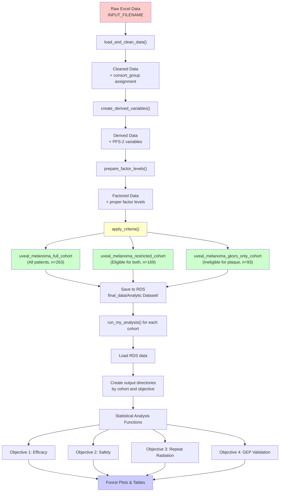

# Uveal Melanoma: GKSRS vs Plaque

## Overview

This project provides a complete pipeline for processing, cleaning, and analyzing clinical data for uveal melanoma patients, with a focus on comparing outcomes between Gamma Knife Stereotactic Radiosurgery (GKSRS) and plaque brachytherapy. The analysis is organized around **4 primary study objectives** with results structured for easy navigation by research question.

**Author:** Nicholas Camarda

---

## Study Objectives

The analysis is structured around four prioritized research objectives:

### **Objective 1: Efficacy of Plaque vs GKSRS (COMPLETE)**
**Primary research question:** How do clinical outcomes compare between treatments?
- **1a.** Local recurrence rates
- **1b.** Metastatic progression rates  
- **1c.** Overall survival
- **1d.** Progression-free survival
- **1e.** Tumor height changes (primary analysis)
- **1f.** Tumor height changes (sensitivity analysis) 
- **1g.** Subgroup analysis (treatment effect heterogeneity)

### **Objective 2: Safety/Toxicity (COMPLETE)**
**Primary research question:** What are the comparative safety profiles?
- **2a.** Vision changes
- **2b.** Radiation retinopathy rates
- **2c.** Neovascular glaucoma rates
- **2d.** Serous retinal detachment rates

### **Objective 3: Repeat Radiation Efficacy (COMPLETE)**  
**Primary research question:** How effective are second-line treatments?
- **3a.** Progression-Free Survival-2 (PFS-2) analysis

### **Objective 4: GEP Predictive Accuracy (NOT IMPLEMENTED)**
**Primary research question:** How well do gene expression profiles predict outcomes?
- **4a.** Metastasis-free survival validation
- **4b.** Melanoma-specific survival validation

---

## Data Processing Workflow

The analysis follows a systematic data processing pipeline with built-in validation checkpoints:



---

## Cohort Definitions

The analysis includes three distinct patient cohorts based on tumor characteristics and treatment eligibility:

### **Full Cohort** (n=263)
- **Definition:** All patients who received either GKSRS or plaque brachytherapy
- **Purpose:** Real-world effectiveness comparison across all tumor sizes and locations

### **Restricted Cohort** (n=169) 
- **Definition:** Patients eligible for **both** treatments
- **Criteria:** Tumor diameter ≤20mm AND height ≤10mm AND no optic nerve involvement
- **Purpose:** Balanced comparison minimizing treatment selection bias

### **GKSRS-Only Cohort** (n=93)
- **Definition:** Patients **ineligible** for plaque brachytherapy
- **Criteria:** Tumor diameter >20mm OR height >10mm OR optic nerve involvement
- **Purpose:** GKSRS effectiveness in challenging cases where plaque is not feasible

---

## Directory Structure

Analysis outputs are organized by **cohort → objective → sub-objective**:

```
project_working_directory/
├── data/                                    # Raw data files
├── final_data/
│   ├── Analytic Dataset/                    # Processed datasets (RDS, Excel)
│   └── Analysis/                            # NEW STRUCTURE
│       ├── uveal_full/                      # Full cohort results
│       │   ├── 00_General/                  # Cross-cutting analyses
│       │   │   ├── baseline_characteristics/
│       │   │   └── treatment_duration/
│       │   ├── 01_Efficacy/                 # OBJECTIVE 1
│       │   │   ├── a_recurrence/
│       │   │   ├── b_metastatic_progression/
│       │   │   ├── c_overall_survival/
│       │   │   ├── d_progression_free_survival/
│       │   │   ├── e_tumor_height_primary/
│       │   │   ├── f_tumor_height_sensitivity/
│       │   │   ├── g_subgroup_analysis/     # CONSOLIDATED
│       │   │   │   ├── tumor_height_primary/
│       │   │   │   ├── tumor_height_sensitivity/
│       │   │   │   ├── clinical_outcomes/   # Subgroup analysis for all primary outcomes
│       │   │   │   └── forest_plots/        # FOREST PLOTS
│       │   │   └── h_proportional_hazards_diagnostics/  # PH ASSUMPTION TESTING
│       │   ├── 02_Safety/                   # OBJECTIVE 2  
│       │   │   ├── a_vision_changes/
│       │   │   ├── b_retinopathy/
│       │   │   ├── c_neovascular_glaucoma/
│       │   │   └── d_serous_retinal_detachment/
│       │   ├── 03_Repeat_Radiation/         # OBJECTIVE 3
│       │   │   ├── a_pfs2/
│       │   │   └── b_proportional_hazards_diagnostics/  # PH ASSUMPTION TESTING
│       │   └── 04_GEP_Validation/           # OBJECTIVE 4
│       │       ├── a_metastasis_free_survival/
│       │       └── b_melanoma_specific_survival/
│       ├── uveal_restricted/                # Same structure for restricted cohort
│       └── gksrs/                          # Same structure for GKSRS-only cohort
├── logs/                                   # Analysis logs
├── scripts/
│   ├── main.R                              # UPDATED: Main analysis pipeline
│   ├── data_helper/
│   │   └── data_processing.R               # Data cleaning and cohort creation
│   ├── analysis/
│   │   ├── statistical_analysis.R         # Core statistical functions
│   │   ├── tumor_height_analysis.R        # Tumor dimension analysis
│   │   ├── vision_safety_analysis.R       # Safety endpoint analysis
│   │   └── subgroup_analysis.R             # CONSOLIDATED: All subgroup analyses
│   ├── visualization/
│   │   └── forest_plot.R                   # NEW: Forest plot generation
│   ├── utils/
│   │   ├── output_utilities.R              # UPDATED: New directory structure
│   │   └── analysis_config.R               # Analysis settings and configurations
│   └── tests/                              # Unit tests and validation
└── README.md                               # This file
```


---

## Implementation Status: Analysis Pipeline

### **OBJECTIVE 1: Efficacy Analysis (COMPLETE)**

All primary efficacy analyses have been implemented with comprehensive outputs:

#### **1a. Local Recurrence**
- **Method:** Time-to-event analysis with Cox regression
- **Implementation:** `analyze_binary_outcome_rates()` function
- **Outputs:** Event rates (.xlsx), Cox models (.html), survival curves (.png)
- **Location:** `{cohort}/01_Efficacy/a_recurrence/`

#### **1b. Metastatic Progression** 
- **Method:** Time-to-event analysis with Cox regression
- **Implementation:** `analyze_binary_outcome_rates()` function  
- **Outputs:** Event rates (.xlsx), Cox models (.html), survival curves (.png)
- **Location:** `{cohort}/01_Efficacy/b_metastatic_progression/`

#### **1c. Overall Survival**
- **Method:** Kaplan-Meier + Cox regression + RMST analysis
- **Implementation:** `analyze_time_to_event_outcomes()` function
- **Outputs:** Survival tables (.xlsx), Cox models (.html), survival curves (.png), RMST progression plots (.png)
- **Location:** `{cohort}/01_Efficacy/c_overall_survival/`

#### **1d. Progression-Free Survival**
- **Method:** Composite endpoint (progression OR death) with full survival analysis
- **Implementation:** `analyze_time_to_event_outcomes()` function
- **Outputs:** Survival tables (.xlsx), Cox models (.html), survival curves (.png), RMST progression plots (.png)
- **Location:** `{cohort}/01_Efficacy/d_progression_free_survival/`

#### **1e. Tumor Height Changes (Primary)**
- **Method:** Linear regression without baseline height adjustment (avoids overadjustment bias)
- **Implementation:** `analyze_tumor_height_changes()` function
- **Outputs:** Change summaries (.html), regression models (.html)
- **Location:** `{cohort}/01_Efficacy/e_tumor_height_primary/`

#### **1f. Tumor Height Changes (Sensitivity)**
- **Method:** Linear regression with baseline height adjustment (robustness check)
- **Implementation:** `analyze_tumor_height_changes()` function  
- **Outputs:** Change summaries (.html), regression models (.html)
- **Location:** `{cohort}/01_Efficacy/f_tumor_height_sensitivity/`

#### **1g. Subgroup Analysis (COMPLETE)**
- **Method:** Interaction testing across patient subgroups for treatment effect heterogeneity
- **Implementation:** Unified `subgroup_analysis.R` with dedicated functions:
  - `analyze_treatment_effect_subgroups_survival()` - For survival outcomes
  - `analyze_treatment_effect_subgroups_binary()` - For binary outcomes  
  - `analyze_treatment_effect_subgroups_height()` - For tumor height changes
- **Subgroups:** Age, sex, tumor location, initial tumor height/diameter
- **Forest Plots:** Comprehensive forest plot visualization with `create_single_cohort_forest_plot()`
- **Outputs:** 
  - **Primary tumor height subgroups:** `{cohort}/01_Efficacy/g_subgroup_analysis/tumor_height_primary/`
  - **Sensitivity tumor height subgroups:** `{cohort}/01_Efficacy/g_subgroup_analysis/tumor_height_sensitivity/`
  - **Clinical outcomes subgroups:** `{cohort}/01_Efficacy/g_subgroup_analysis/clinical_outcomes/`
  - **Forest plots:** `{cohort}/01_Efficacy/g_subgroup_analysis/forest_plots/`

### **OBJECTIVE 2: Safety/Toxicity Analysis (COMPLETE)**

All safety endpoint analyses have been implemented:

#### **2a. Vision Changes**
- **Method:** Linear regression analysis of visual acuity changes
- **Implementation:** `analyze_visual_acuity_changes()` function
- **Outputs:** Vision change summaries (.html), regression models (.html)  
- **Location:** `{cohort}/02_Safety/a_vision_changes/`

#### **2b. Radiation Retinopathy**
- **Method:** Binary outcome analysis with logistic regression
- **Implementation:** `analyze_radiation_complications()` function
- **Outputs:** Complication rates (.xlsx), logistic regression models (.html)
- **Location:** `{cohort}/02_Safety/b_retinopathy/`

#### **2c. Neovascular Glaucoma**
- **Method:** Binary outcome analysis with logistic regression  
- **Implementation:** `analyze_radiation_complications()` function
- **Outputs:** Complication rates (.xlsx), logistic regression models (.html)
- **Location:** `{cohort}/02_Safety/c_neovascular_glaucoma/`

#### **2d. Serous Retinal Detachment**
- **Method:** Binary outcome analysis (radiation-induced only) with logistic regression
- **Implementation:** `analyze_radiation_complications()` function
- **Outputs:** Complication rates (.xlsx), logistic regression models (.html)
- **Location:** `{cohort}/02_Safety/d_serous_retinal_detachment/`

### **OBJECTIVE 3: Repeat Radiation Efficacy (COMPLETE)**

#### **3a. Progression-Free Survival-2 (PFS-2)**
- **Method:** Survival analysis for patients with local recurrence receiving second-line treatment
- **Implementation:** `analyze_pfs2()` function
- **Outputs:** PFS-2 characteristics tables (.xlsx), survival curves (.png), Cox models (.html)
- **Location:** `{cohort}/03_Repeat_Radiation/a_pfs2/`
- **Note:** Analysis automatically skips survival modeling when insufficient events are present (minimum: 5 total events across 2+ treatment groups)

### **OBJECTIVE 4: GEP Validation (NOT IMPLEMENTED)**

Gene expression profile validation analyses are not yet implemented:

#### **4a. Metastasis-Free Survival Validation**
- **Status:** Not implemented
- **Planned Method:** Validation of GEP classification accuracy for metastasis prediction

#### **4b. Melanoma-Specific Survival Validation**  
- **Status:** Not implemented
- **Planned Method:** Validation of GEP classification accuracy for melanoma-specific survival prediction

---

## Data Limitations and Analysis Constraints

The analysis pipeline includes robust error handling for situations where data limitations prevent certain analyses from completing. This is particularly relevant for smaller cohorts and rare outcomes.

### **Cohort-Specific Limitations**

#### **GKSRS-Only Cohort (n=93)**
- **Step 3 (PFS-2 Analysis):** Insufficient events for survival analysis
  - Only 13 patients with valid PFS-2 data
  - Only 3 total second recurrence events (minimum required: 5)
  - Events concentrated in only 2 treatment groups (GKSRS: 1, TTT: 2)
  - Summary tables are generated, but survival curves and Cox models are skipped

#### **Restricted Cohort (n=169)**
- Generally sufficient sample size for most analyses
- Occasional rare category handling in subgroup analyses due to smaller size than full cohort

#### **Full Cohort (n=263)**
- Generally sufficient sample size for most analyses
- Occasional rare category handling in subgroup analyses

### **Automatic Error Handling**

The analysis pipeline includes built-in safeguards:

1. **Minimum Event Requirements:** 
   - Survival analyses require 5+ total events
   - Cox regression requires 2+ groups with events
   - Logistic regression requires adequate observations per category

2. **Rare Category Management:**
   - Categories with <5 observations are automatically collapsed
   - Variables with insufficient levels after collapsing are excluded from models

3. **Graceful Degradation:**
   - When full analyses cannot be completed, summary statistics are still generated
   - Missing analyses are clearly documented in logs with specific reasons

4. **Comprehensive Logging:**
   - All limitations and skipped analyses are logged with timestamps
   - Detailed error messages explain exactly why analyses were skipped

### **Example from Current Run**

The most recent analysis run (log timestamp: 20250610_181336) demonstrates this error handling:

**GKSRS-Only Cohort - Step 3 (PFS-2):**
- Found 13 patients with local recurrence receiving second-line treatment
- Treatment distribution: Enucleation (8), GKSRS (1), TTT (2), Other (2)
- Only 3 total second recurrence events detected
- Analysis automatically skipped survival modeling due to insufficient events
- Summary tables still generated for available data

---

## Key Features

### **🌲 Forest Plot Functionality**
Comprehensive forest plot generation for subgroup analysis visualization:

- **Function:** `create_single_cohort_forest_plot()` in `scripts/visualization/forest_plot.R`
- **Features:**
  - Dynamic effect measure handling (HR, OR, MD)
  - Automatic log scale for HR/OR, linear scale for mean differences
  - Professional formatting with confidence intervals
  - Treatment direction indicators ("Favours GKSRS" vs "Favours Plaque")
  - High-resolution PNG output (300 DPI)
- **Generated For:** All subgroup analyses across all primary outcomes
- **Location:** `{cohort}/01_Efficacy/g_subgroup_analysis/forest_plots/`

### **🎯 Consolidated Subgroup Analysis**
Unified subgroup analysis framework:

- **File:** `scripts/analysis/subgroup_analysis.R` (replaces multiple scattered functions)
- **Functions:**
  - `analyze_treatment_effect_subgroups_survival()` - Cox regression with interaction terms
  - `analyze_treatment_effect_subgroups_binary()` - Logistic regression with interaction terms
  - `analyze_treatment_effect_subgroups_height()` - Linear regression with interaction terms
  - `format_subgroup_analysis_tables()` - Standardized table formatting
  - `format_subgroup_analysis_results()` - Excel output formatting
- **Coverage:** All primary outcomes + tumor height changes (primary & sensitivity)
- **Output:** Standardized interaction p-values, subgroup-specific effects, forest plots

### **📊 Analysis Configuration**
Set analysis settings globally to improve reproducibility:

- **File:** `scripts/utils/analysis_config.R`
- **Features:** Centralized configuration, consistent variable definitions, confounder specifications
- **Benefits:** Easy modification of analysis parameters, consistent methodology across objectives

---

## Advanced Survival Analysis Features

### **Restricted Mean Survival Time (RMST) Analysis**

All survival endpoints include comprehensive RMST analysis:

#### **RMST Outputs Generated:**
1. **📈 Survival Rate Tables:** 1, 3, 5, 10, and 15-year survival probabilities by treatment
2. **📊 RMST Comparison Tables:** Mean survival time differences (GKSRS vs Plaque) at each time point  
3. **📉 P-value Progression Plots:** Visual representation of statistical significance evolution over time

#### **🎨 RMST P-value Progression Plots**
- **Purpose:** Shows how treatment differences evolve across follow-up periods
- **Features:**
  - P-values plotted across multiple time points (1, 3, 5, 10, 15 years)
  - Color-coded significance levels (red = significant, blue = not significant)
  - Reference lines at p = 0.05 and p = 0.01
  - Annotations with exact p-values and RMST differences in months
  - Treatment direction indicators (+ = GKSRS advantage, - = GKSRS disadvantage)
- **Clinical Value:** Identifies optimal time points for treatment comparisons and quantifies survival benefit magnitude
- **Location:** `{cohort}/01_Efficacy/{outcome}/` for OS and PFS analyses

#### **Example Interpretation:**
- **p = 0.033, +2.1 mo** at 3 years = GKSRS provides 2.1 months longer survival (p = 0.033)
- **p = 0.331, -1.2 mo** at 10 years = No significant difference, slight numerical GKSRS disadvantage

### **Proportional Hazards Assumption Testing**

All Cox regression analyses automatically include comprehensive testing of the proportional hazards (PH) assumption using Schoenfeld residuals to detect time-varying treatment effects.

#### **What is the Proportional Hazards Assumption?**
The Cox proportional hazards model assumes that the hazard ratio between treatment groups remains **constant over time**. When this assumption is violated, it means the treatment effect changes over time - for example, "plaque significant survival early on then GKSRS seems to take over."

#### **Files Generated**
For each survival outcome, the analysis creates these files in the `h_proportional_hazards_diagnostics/` directory:

**1. Test Results (`*_proportional_hazards_tests.xlsx`)**
- **P_Value**: Statistical test for each variable
- **PH_Assumption**: "VIOLATED" if p < 0.05, "OK" if p ≥ 0.05
- **Interpretation**: Plain English explanation of the test result

**2. Diagnostic Plots**
- **Individual plots** (`*_schoenfeld_*.png`): One plot per variable showing residuals vs time
- **Combined plot** (`*_schoenfeld_combined.png`): All variables in one figure

**3. Summary Text** (`*_proportional_hazards_summary.txt`)
- Detailed interpretation and recommendations

#### **How to Interpret Results**

**Statistical Tests:**
- **p < 0.05**: **VIOLATION** - The treatment effect changes significantly over time
- **p ≥ 0.05**: **OK** - No evidence that treatment effect changes over time
- **Global test**: Overall test across all variables in the model

**Schoenfeld Residual Plots:**
These plots show if the treatment effect is constant over time:
- **Flat horizontal line around zero**: PH assumption is satisfied
- **Clear trend (slope up or down)**: PH assumption is violated
- **Curved pattern**: Treatment effect changes non-linearly over time

#### **What to Do if PH is Violated**

1. **Time-varying coefficients**: Fit models that allow treatment effects to change over time
2. **Stratification**: Stratify by the violating variable
3. **Piecewise models**: Fit separate models for early vs late time periods
4. **Alternative models**: Consider accelerated failure time models

#### **Clinical Interpretation**

If **treatment_group** violates the PH assumption:
- Early survival advantage may favor one treatment
- Late survival advantage may favor the other treatment
- The overall hazard ratio from Cox regression may be misleading
- Consider reporting separate effects for early vs late periods

**Example Scenario**: Overall Survival analysis shows treatment_group p = 0.02 (VIOLATED)

**Clinical meaning**: 
- The treatment effect is not constant over time
- One treatment may be better in the short term, the other in the long term
- The single hazard ratio from Cox regression doesn't tell the full story
- Need to examine when the treatment effects cross over

**Outputs Location:**
- **Objective 1 (Efficacy)**: `{cohort}/01_Efficacy/h_proportional_hazards_diagnostics/`
- **Objective 3 (PFS-2)**: `{cohort}/03_Repeat_Radiation/b_proportional_hazards_diagnostics/`

---

## Requirements

### **R Version**
- **R >= 4.0.0**

### **Required R Packages**
```r
# Core data manipulation and analysis
tidyverse, readxl, writexl, lubridate, janitor

# Statistical analysis and tables  
gtsummary, survival, survminer, survRM2, gt

# Visualization and plots
forestplot, grid, cowplot, ggplot2

# Testing and documentation
testthat
```

### **Installation**
```r
install.packages(c(
  "tidyverse", "readxl", "writexl", "lubridate", "gtsummary", "janitor",
  "gt", "survival", "survminer", "survRM2", "forestplot", "grid", "cowplot", "testthat"
))
```

---

## Usage

### **1. 📁 Prepare Data**
Place your raw Excel data file in the `data/` directory.

### **2. ⚙️ Configure Analysis**
Edit `scripts/main.R` to set:
```r
# Input filename
fn <- "Ocular Melanoma Master Spreadsheet REVISED FOR STATS (5-10-25, TJM).xlsx"

# Analysis settings
RECREATE_ANALYTIC_DATASETS <- TRUE  # Set to TRUE for fresh analysis
USE_LOGS <- TRUE                    # Enable detailed logging
VERBOSE <- TRUE                     # Show detailed progress
```

### **3. 🚀 Run Complete Analysis**
```r
# Run the full pipeline
source("scripts/main.R")
```

This executes the complete analysis pipeline:
- Data cleaning and validation
- Cohort creation (full, restricted, GKSRS-only)  
- All 4 study objectives with comprehensive outputs
- Forest plots and subgroup analyses
- Professional tables and visualizations

### **4. 🧪 Validation (Optional)**
```r
# Run unit tests to validate pipeline
library(testthat)
source("scripts/tests/run_all_tests.R")
```

---

## License

*Research use only - no license currently specified.*
---

