# High-Level Dependency Diagram

This Mermaid diagram shows the main modules and their dependencies at a high level. It groups components by folder and highlights the flow from configuration → loader → data processing → objectives → outputs.

```mermaid
flowchart LR
    %% Core config
    subgraph CFG[Config]
        CONFIG[utils/config_constants.R]
    end

    %% Loader orchestrates sourcing and directory setup
    subgraph LDR[Loader]
        LOADALL[scripts/load_all.R]
    end

    %% Utilities and shared helpers
    subgraph UTL[Utils]
        LOGU[utils/logging_utilities.R]
        OUTU[utils/output_utilities.R]
        VALU[utils/validation_utilities.R]
        MODU[utils/model_utilities.R]
        CPLT[utils/color_palettes.R]
        EXTR[utils/extreme_estimate_handling.R]
        FPDG[utils/forest_plot_diagnostics.R]
    end

    %% Tables
    subgraph TBL[Tables]
        TCORE[tables/table_generation_core.R]
        TMOD[tables/table_model_fitting.R]
        TFRM[tables/table_formatting.R]
        TDIAG[tables/table_diagnostics.R]
        TIO[tables/table_io.R]
    end

    %% Data helper pipeline
    subgraph DATA[Data Helper]
        DLOAD[data_helper/data_loading.R]
        DDER[data_helper/data_derivation.R]
        DCOH[data_helper/cohort_creation.R]
        DSUM[data_helper/data_summaries.R]
        DUTIL[data_helper/data_utilities.R]
        DORCH[data_helper/cohort_orchestration.R]
    end

    %% Analysis modules
    subgraph ANA[Analysis]
        ABIN[analysis/binary_outcomes.R]
        ASUR[analysis/survival_outcomes.R]
        AHT[analysis/tumor_height_analysis.R]
        AVS[analysis/vision_safety_analysis.R]
        ARMST[analysis/rmst_visualization.R]
    end

    %% Subgroup modules
    subgraph SBG[Subgroup]
        SBDP[subgroup/subgroup_data_prep.R]
        SBIN[subgroup/subgroup_binary.R]
        SBSV[subgroup/subgroup_survival.R]
        SBHT[subgroup/subgroup_height.R]
        SBFRM[subgroup/subgroup_formatting.R]
    end

    %% Visualization
    subgraph VIS[Visualization]
        FPD[visualization/forest_plot_data.R]
        FPDRAW[visualization/forest_plot_draw.R]
        FPFMT[visualization/forest_plot_formatting.R]
    end

    %% GEP validation
    subgraph GEP[GEP Validation]
        GMET[gep/utils/gep_model_evaluation_metrics.R]
        GXL[gep/utils/gep_excel_output.R]
        GEXT[gep/utils/gep_extrapolation_assumptions.R]
        GMFS[gep/cores/gep_evaluation_core_mfs.R]
        GMSS[gep/cores/gep_evaluation_core_mss.R]
        GVIS[gep/visualization/gep_visuals.R]
        GRC[gep/reporting/gep_reporting_core.R]
        GTBL[gep/reporting/gep_table_creation.R]
        GSUM[gep/reporting/gep_summary_generation.R]
        GCLI[gep/reporting/gep_clinical_interpretation.R]
        GOUT[gep/reporting/gep_output_consolidation.R]
        GSENS[gep/reporting/gep_mfs_sensitivity_reporting.R]
        GSIMP[gep/reporting/gep_simple_validation.R]
        GORCH[gep/orchestration/gep_evaluation_orchestration.R]
        GNOGEP[gep/orchestration/gep_exploratory_no_gep_report.R]
    end

    %% Workflow / orchestration and objectives
    subgraph WFL[Workflow]
        AORCH["workflow/analysis_orchestration.R: main_execution, run_my_analysis, run_specific_objective"]
        OBJ0[workflow/objective_0_data_processing.R]
        OBJ1[workflow/objective_1_primary_outcomes.R]
        OBJ2[workflow/objective_2_safety_toxicity.R]
        OBJ3[workflow/objective_3_repeat_radiation.R]
        OBJ4[workflow/objective_4_gep_analysis.R]
    end

    %% I/O anchors
    RAW[(~/Library/CloudStorage/OneDrive-Personal/Research/uveal_melanoma/Original Files/*.xlsx)]
    PDATA[(~/ProjectsRuntime/uveal_melanoma/Analytic Dataset/*.rds, other_map.rds)]
    OUT[(~/ProjectsRuntime/uveal_melanoma/Analysis/...)]
    LOGS[(~/ProjectsRuntime/uveal_melanoma/logs/...)]

    %% Edges: config and loader
    LOADALL --> CONFIG
    LOADALL --> LOGU
    LOADALL --> OUTU
    LOADALL --> VALU
    LOADALL --> MODU
    LOADALL --> CPLT
    LOADALL --> EXTR
    LOADALL --> TCORE
    LOADALL --> TMOD
    LOADALL --> TFRM
    LOADALL --> TDIAG
    LOADALL --> TIO
    LOADALL --> DLOAD
    LOADALL --> DDER
    LOADALL --> DCOH
    LOADALL --> DSUM
    LOADALL --> DUTIL
    LOADALL --> DORCH
    LOADALL --> ABIN
    LOADALL --> ASUR
    LOADALL --> AHT
    LOADALL --> AVS
    LOADALL --> ARMST
    LOADALL --> SBDP
    LOADALL --> SBIN
    LOADALL --> SBSV
    LOADALL --> SBHT
    LOADALL --> SBFRM
    LOADALL --> FPD
    LOADALL --> FPDRAW
    LOADALL --> FPFMT
    LOADALL --> GMET
    LOADALL --> GXL
    LOADALL --> GEXT
    LOADALL --> GMFS
    LOADALL --> GMSS
    LOADALL --> GVIS
    LOADALL --> GRC
    LOADALL --> GTBL
    LOADALL --> GSUM
    LOADALL --> GCLI
    LOADALL --> GOUT
    LOADALL --> GSENS
    LOADALL --> GSIMP
    LOADALL --> GORCH
    LOADALL --> GNOGEP
    LOADALL --> AORCH

    %% Objective dependencies
    AORCH --> OBJ0 & OBJ1 & OBJ2 & OBJ3 & OBJ4

    %% Objective 0 (data processing) pipeline
    OBJ0 --> DORCH
    DLOAD --> RAW
    DORCH --> DLOAD & DDER & DUTIL & DCOH & DSUM
    DORCH --> PDATA

    %% Objective 1 (efficacy)
    OBJ1 --> ABIN & ASUR & AHT
    OBJ1 --> SBDP & SBIN & SBSV & SBHT & SBFRM
    OBJ1 --> FPD & FPDRAW & FPFMT & FPDG
    OBJ1 --> TCORE & TMOD & TFRM & TDIAG & TIO

    %% Objective 2 (safety/toxicity)
    OBJ2 --> AVS & ABIN
    OBJ2 --> TCORE & TMOD & TFRM & TDIAG & TIO

    %% Objective 3 (repeat radiation)
    OBJ3 --> ASUR & ARMST
    OBJ3 --> TCORE & TMOD & TFRM & TDIAG & TIO

    %% Objective 4 (GEP validation)
    OBJ4 --> GMET & GXL & GEXT & GMFS & GMSS & GVIS & GRC & GTBL & GSUM & GCLI & GOUT & GSENS & GSIMP & GORCH & GNOGEP
    OBJ4 --> TCORE & TMOD & TFRM & TDIAG & TIO

    %% Outputs
    OBJ1 --> OUT
    OBJ2 --> OUT
    OBJ3 --> OUT
    OBJ4 --> OUT
    LOADALL --> LOGS
```



Rendering locally (optional): if you have Mermaid CLI installed, run:

```
mmdc -i docs/dependency_diagram.md -o docs/dependency_diagram.png
```
