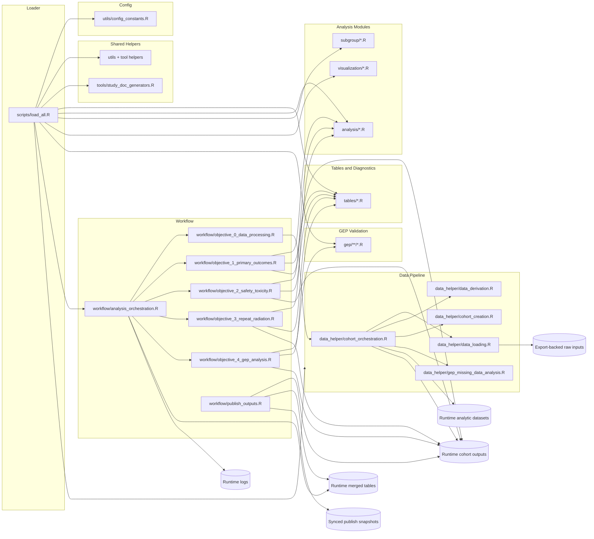

# High-Level Dependency Diagram

This file is generated from the current loader plus curated workflow/output rules. The Mermaid diagram stays high-level; the appendix captures the full sourced inventory so the doc does not drift from `scripts/load_all.R`.

## Notes

- The main loader inventory is taken from `scripts/load_all.R` rather than maintained by hand.
- Objective 0 now owns the runtime audit trail that feeds cohort `00_General` artifacts.
- Published synced snapshots are created by `workflow/publish_outputs.R`, so the output model now includes both runtime and synced layers.

## Loader Inventory

### Other

- `analysis`
- `analysis_orchestration.R`
- `binary_outcomes.R`
- `cohort_creation.R`
- `cohort_orchestration.R`
- `cohort_summary_export.R`
- `color_palettes.R`
- `config_constants.R`
- `cores`
- `data_derivation.R`
- `data_helper`
- `data_loading.R`
- `data_summaries.R`
- `data_utilities.R`
- `effect_summary_audit.R`
- `extreme_estimate_handling.R`
- `factor_level_audit.R`
- `forest_plot_data.R`
- `forest_plot_diagnostics.R`
- `forest_plot_draw.R`
- `forest_plot_formatting.R`
- `gep`
- `gep_clinical_interpretation.R`
- `gep_evaluation_core_mfs.R`
- `gep_evaluation_core_mss.R`
- `gep_evaluation_orchestration.R`
- `gep_excel_output.R`
- `gep_exploratory_internal_validation.R`
- `gep_exploratory_no_gep_report.R`
- `gep_extrapolation_assumptions.R`
- `gep_mfs_sensitivity_reporting.R`
- `gep_missing_data_analysis.R`
- `gep_model_evaluation_metrics.R`
- `gep_output_consolidation.R`
- `gep_poster_km_plots.R`
- `gep_reporting_core.R`
- `gep_simple_validation.R`
- `gep_summary_generation.R`
- `gep_table_creation.R`
- `gep_visuals.R`
- `logging_utilities.R`
- `markdown_utilities.R`
- `model_utilities.R`
- `objective0_validation_engine.R`
- `objective_0_data_processing.R`
- `objective_1_primary_outcomes.R`
- `objective_2_safety_toxicity.R`
- `objective_3_repeat_radiation.R`
- `objective_4_gep_analysis.R`
- `orchestration`
- `output_utilities.R`
- `plot_utilities.R`
- `propensity_score_sensitivity.R`
- `publish_outputs.R`
- `reporting`
- `rmst_visualization.R`
- `scripts`
- `study_doc_generators.R`
- `subgroup`
- `subgroup_binary.R`
- `subgroup_data_prep.R`
- `subgroup_formatting.R`
- `subgroup_height.R`
- `subgroup_survival.R`
- `survival_outcomes.R`
- `table_diagnostics.R`
- `table_formatting.R`
- `table_generation_core.R`
- `table_io.R`
- `table_model_fitting.R`
- `tables`
- `tool_runtime_helpers.R`
- `tools`
- `tumor_height_analysis.R`
- `utils`
- `validation_reporting.R`
- `validation_utilities.R`
- `vision_helpers.R`
- `vision_safety_analysis.R`
- `visualization`
- `workflow`

